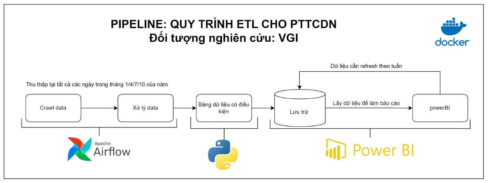
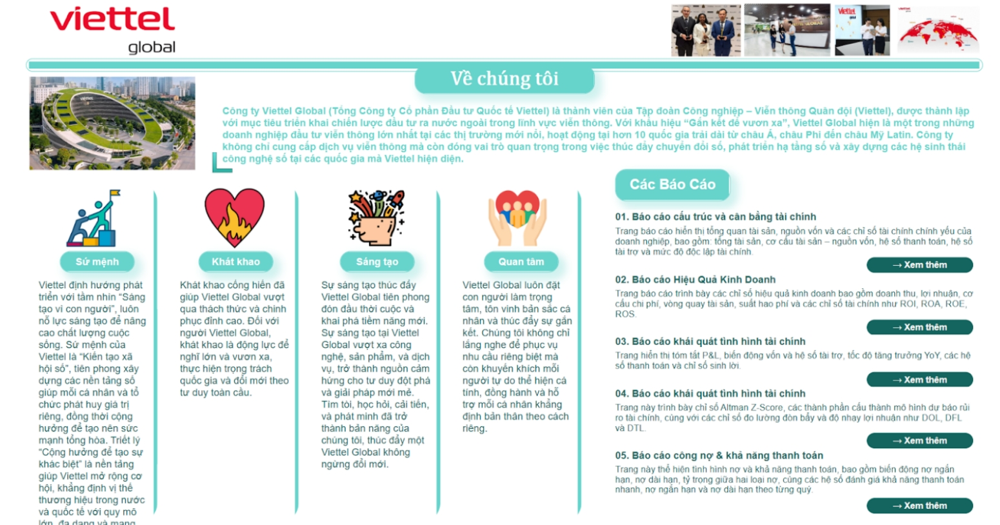
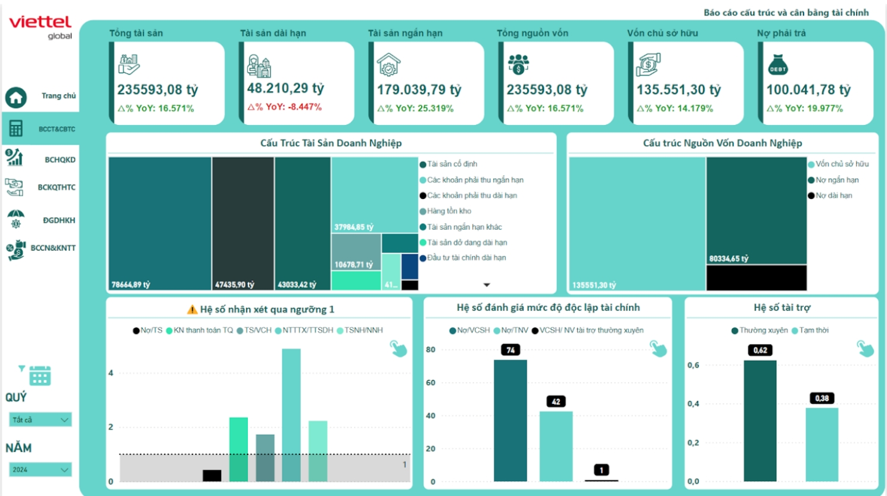
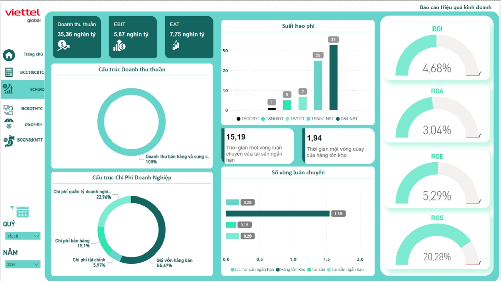
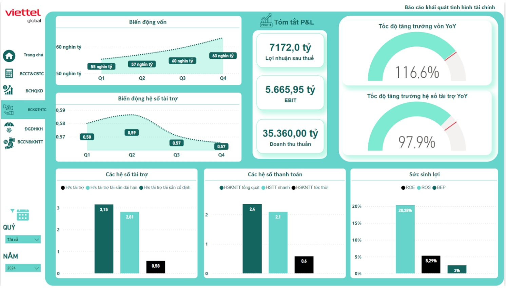
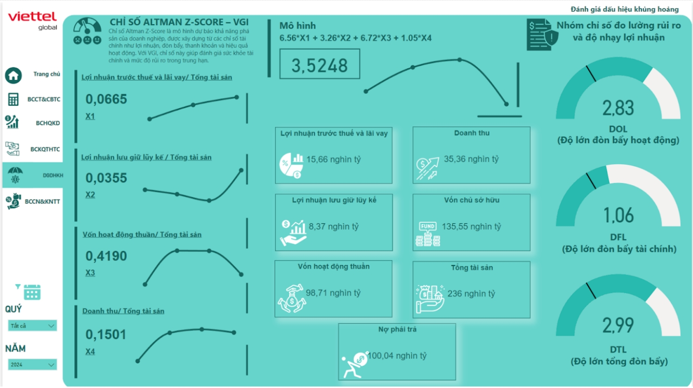
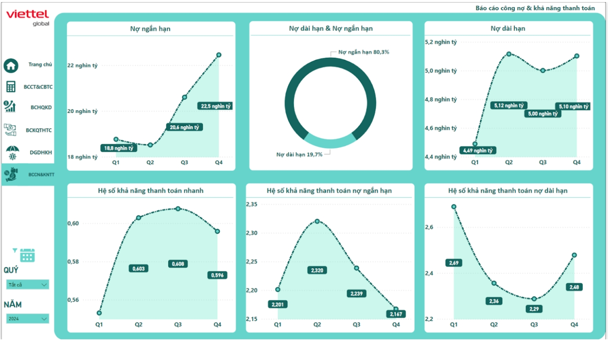

Dự án: Quy Trình ETL Phân Tích Tài Chính Doanh Nghiệp - VGI

🔍 Giới thiệu tổng quan

Dự án này xây dựng một pipeline hoàn chỉnh để tự động hóa quy trình thu thập và xử lý dữ liệu tài chính doanh nghiệp, phục vụ cho việc phân tích hiệu quả hoạt động của công ty VGI.

Quy trình được đóng gói bằng Docker và sử dụng Apache Airflow để lên lịch tự động, với đích đến cuối cùng là trình bày dữ liệu qua Power BI dưới dạng các báo cáo tài chính chuyên sâu.

Pipeline dựa trên nền tảng lý thuyết phân tích tài chính doanh nghiệp, bao gồm các chỉ số quan trọng từ:

- Bảng cân đối kế toán

- Báo cáo kết quả hoạt động kinh doanh

- Báo cáo lưu chuyển tiền tệ

📊 Nội dung báo cáo tập trung:

- Phân tích cấu trúc và cân bằng nguồn vốn - tài sản

- Khả năng thanh toán và công nợ

- Dự báo rủi ro và khủng hoảng tài chính

- Đánh giá tình hình tài chính tổng thể

- Hiệu quả kinh doanh và sinh lời

⚙️ Quy trình kỹ thuật

1. Hai chế độ vận hành ETL

a. ETL thủ công qua Web Flask

Dự án có xây dựng một ứng dụng web đơn giản sử dụng Flask để hỗ trợ người dùng có thể chủ động thực hiện quy trình ETL thủ công.

Chức năng chính:

Crawl dữ liệu bằng tay: vẫn giữ cách crawl dữ liệu bằng Golang để đảm bảo hiệu suất cao.

Xử lý dữ liệu: sau khi crawl, hệ thống gọi mã Python để làm sạch và lưu dưới dạng .csv.

Thao tác đơn giản: chỉ cần một dòng lệnh cơ bản hoặc giao diện trực quan là có thể kích hoạt toàn bộ quy trình ETL.

🔸 Web Flask đóng vai trò như một giao diện để người dùng kiểm soát và thực thi quá trình ETL thủ công.

b. ETL tự động bằng Airflow + Docker

Bên cạnh phiên bản thủ công, dự án còn cung cấp quy trình ETL tự động:

Crawl dữ liệu: sử dụng Python để dễ dàng tích hợp với Apache Airflow.

Transform và Load: giống quy trình trên, làm sạch bằng Python và lưu .csv.

Tự động hóa: chạy định kỳ theo lịch (ngày/tháng/tuần) được định nghĩa trong DAG.

Docker hóa: giúp dễ triển khai, quản lý và mở rộng quy mô.

✅ Đây là phiên bản chính, giúp hệ thống luôn cập nhật dữ liệu mới và phục vụ tốt cho báo cáo BI tự động.

## 📁 Cấu trúc thư mục

| Thư mục / Tệp              | Mô tả                                                             |
|---------------------------|--------------------------------------------------------------------|
| `config/`                 | Cấu hình ETL                                                      |
| `csv/`                    | Dữ liệu đã xử lý ở dạng CSV                                       |
| `dags/`                   | DAGs Airflow                                                      |
| `extract/`                | Mã crawl dữ liệu (Golang cho Web, Python cho Airflow)             |
| `transform/`              | Làm sạch và xử lý dữ liệu                                         |
| `load/`                   | Load dữ liệu vào hệ thống                                         |
| `logs/`                   | Log pipeline                                                      |
| `web_flask/`              | Flask app hỗ trợ thao tác thủ công                                |
| `.env`                    | Biến môi trường cấu hình                                          |
| `Dockerfile`              | Docker image chính                                                |
| `docker-compose.yaml`     | Docker orchestration                                              |
| `requirements.txt`        | Thư viện Python cho ETL                                           |
| `requirements2.txt`       | (Tuỳ chọn) Thư viện cho Flask Web                                 |


🚀 Hướng dẫn cài đặt

Bước 1: Clone Repo
```
git clone https://github.com/NgPcAnhh/ETL_web_PowerBI
```
```
cd ETL_web_PowerBI
```
Bước 2: Thiết lập biến môi trường

Tạo file .env dựa trên mẫu có sẵn để cấu hình đường dẫn, dữ liệu, database,...

Bước 3: Chạy Docker Compose
```
docker-compose up --build
```
Lệnh này sẽ khởi động các dịch vụ:

Giao diện Airflow tại localhost:8080

Web Flask (nếu có)

Database (nếu có cấu hình PostgreSQL, SQLite,...)

Bước 4: Truy cập và kích hoạt DAGs

Truy cập Airflow tại ```http://localhost:8080```

Bật DAG Crawl và DAG ETL (theo lịch định kỳ hoặc thủ công)

Bước 5: Kết nối với Power BI

Mở Power BI Desktop

Kết nối tới file .csv trong thư mục csv/ hoặc database nếu có

Thiết lập chế độ làm mới tự động theo tuần (Power BI Service Premium)

⚠️ Lưu ý: Đảm bảo rằng bạn đang sử dụng bản Power BI Premium để có thể cấu hình refresh tự động.

Bước 6: Trải nghiệm quy trình ETL thủ công qua Flask Web

Chạy file Flask:

python web_flask/app.py

Truy cập web tại ```http://localhost:5000```

Đăng nhập với tài khoản admin mặc định

Chạy lệnh /admin suggest để tham khảo và sử dụng các chức năng hướng dẫn crawl dữ liệu, xử lý thủ công có sẵn.

Kết quả: 






